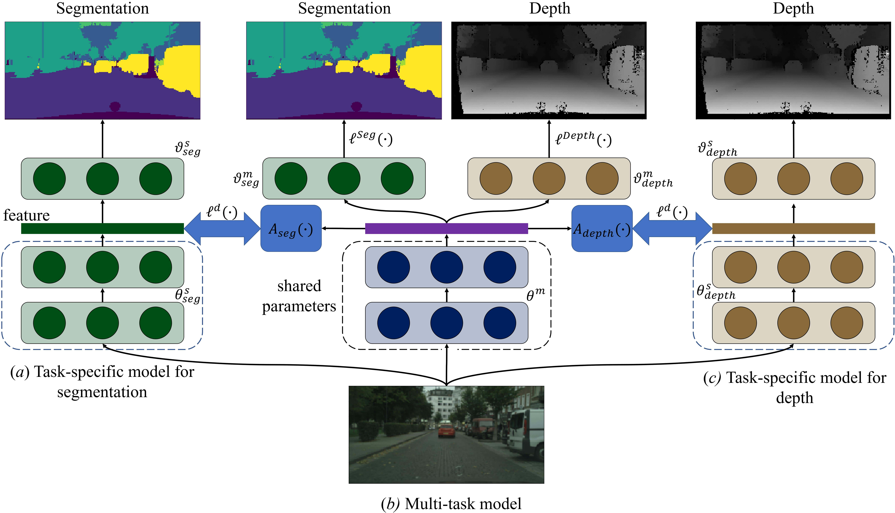

# Knowledge Distillation for Multi-task Learning
This is the implementation of [Knowledge Distillation for Multi-task Learning](https://arxiv.org/pdf/2007.06889.pdf) introduced by [Wei-Hong Li](https://weihonglee.github.io) and [Hakan Bilen](http://homepages.inf.ed.ac.uk/hbilen/index.html). We provide code for our method that performs semantic segmentation, depth estimation and surface normal estimation on NYU-v2 dataset using SegNet and MTAN. The repository also contains code for baselines which are compared in our paper. All methods are implemented in Pytorch


<center></center>

## Requirements
- Python 3.6+
- PyTorch 1.0 (or newer version)
- torchvision 0.2.2 (or newer version)
- progress
- matplotlib
- numpy

## Usage

### Prepare dataset

We use the preprocessed [`NYUv2` dataset](https://www.dropbox.com/sh/86nssgwm6hm3vkb/AACrnUQ4GxpdrBbLjb6n-mWNa?dl=0) provided by [this repo](https://github.com/lorenmt/mtan). Download the dataset and place the dataset folder in `./data/`

### Our method

* train the single task learning models with SegNet:
```
python model_segnet_single.py --gpu <gpu_id> --out SegNet-single --dataroot ./data/nyuv2 --task <task: semantic, depth, normal>
```
or with MTAN
```
python model_mtan_single.py --gpu <gpu_id> --out mtan-single --dataroot ./data/nyuv2 --task <task: semantic, depth, normal>
```

* train the multi-task learning model using our KD-MTL with SegNet:
```
python model_segnet_kdmtl.py --gpu <gpu_id> --alr 1e-1 --out SegNet-KD-MTL --single-dir ./SegNet-single/ --dataroot ./data/nyuv2
```
or with MTAN
```
python model_mtan_kdmtl.py --gpu <gpu_id> --alr 1e-1 --out MTAN-KD-MTL --single-dir ./mtan-single/ --dataroot ./data/nyuv2
```

### Baselines

We provide code, `model_segnet_baselines.py` and `model_mtan_baselines.py`, for several balancing loss weighting approaches including Uniformly weighting, [MGDA](https://arxiv.org/abs/1810.04650) (adapted from the [source code](https://github.com/intel-isl/MultiObjectiveOptimization)), [GradNorm](https://arxiv.org/abs/1711.02257), and [DWA](https://arxiv.org/abs/1803.10704) ([source code](https://github.com/lorenmt/mtan)). 

* Train the multi-task learning model using MGDA with SegNet:
```
python model_segnet_baselines.py --gpu <gpu_id> --out baselines --dataroot ./data/nyuv2 --weight mgda #weight: uniform, mgda, gradnorm, dwa
```
or with MTAN
```
python model_mtan_baselines.py --gpu <gpu_id> --out baselines --dataroot ./data/nyuv2 --weight mgda #weight: uniform, mgda, gradnorm, dwa
```

* For [Uncertainty weighting](https://openaccess.thecvf.com/content_cvpr_2018/papers/Kendall_Multi-Task_Learning_Using_CVPR_2018_paper.pdf) and [MTAN](https://arxiv.org/abs/1803.10704), please refer to [this repo](https://github.com/lorenmt/mtan)

## Acknowledge
We thank Shikun Liu and Ozan Sener for their source code of [MTAN](https://github.com/lorenmt/mtan) and [MGDA](https://github.com/intel-isl/MultiObjectiveOptimization).  

## Contact
For any question, you can contact `w.h.li@ed.ac.uk`.

## Citation
If you find this code to be useful in your work and use it for a publication, please kindly cite:
```
@inproceedings{li2020knowledge,
  title={Knowledge Distillation for Multi-task Learning},
  author={Li, Wei-Hong and Bilen, Hakan},
  booktitle={Proceedings of the European Conference on Computer Vision Workshop on Imbalance Problems in Computer Vision},
  year={2020}
}
```


